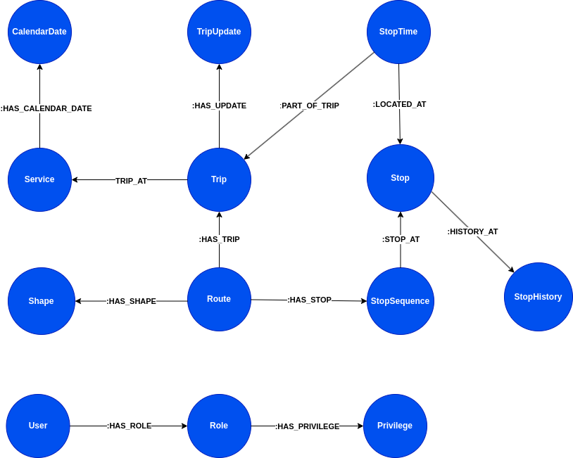

# Macbus Backend

## Tecnologías utilizadas

- **Spring Boot**: Framework de desarrollo en Java para crear aplicaciones basadas en microservicios.
- **Neo4j**: Base de datos orientada a grafos.
- **JWT (JSON Web Token)**: Autenticación y autorización segura basada en tokens.
- **Spring Security**: Framework de seguridad para la protección de endpoints.

## Requisitos previos

Antes de comenzar, asegúrate de tener instalados los siguientes requisitos en tu máquina:

- **JDK 17**
- **Maven**
- **Neo4j** (puedes usar Neo4j Desktop o ejecutar una instancia de Neo4j en Docker)
- **Postman** o cualquier otra herramienta para realizar pruebas de la API (opcional)

## Instalación

### 1. Clona el repositorio:

```bash
git clone https://github.com/abelmamani/macbus-backoffice-spring-boot.git
```

### 2. Configura el archivo application.properties

```bash
spring.neo4j.uri=bolt://localhost:7687
spring.neo4j.authentication.username=neo4j
spring.neo4j.authentication.password=tu_password
spring.mail.username=tu_email
spring.mail.password=tu_contraseña_de_aplicacion
```
### 3. Construye el proyecto:
```bash
mvn clean install
```
### 4. Crea la imagen Docker y ejecuta el contenedor (opcional):
```bash
docker build -t macbus-backend .
docker run --name macbus-api -d -p 8080:8080 macbus-backend
```
